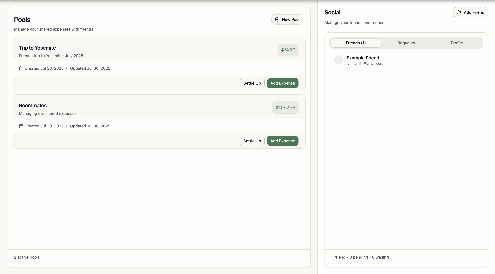
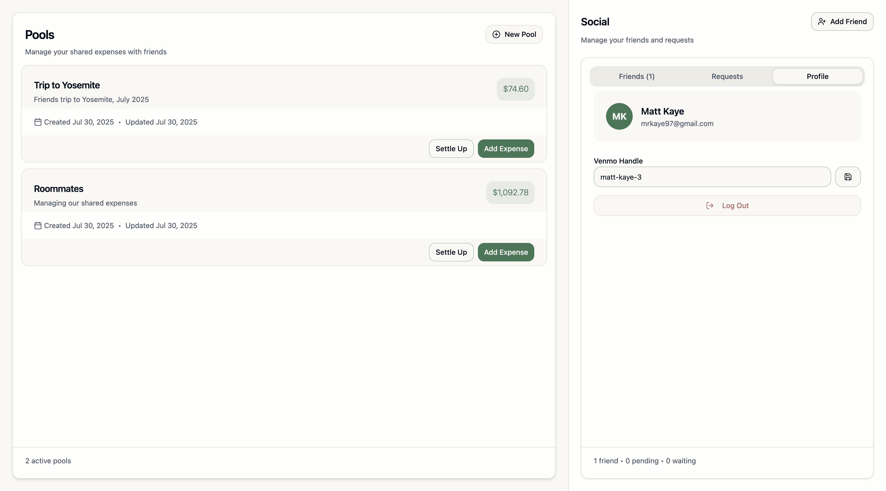
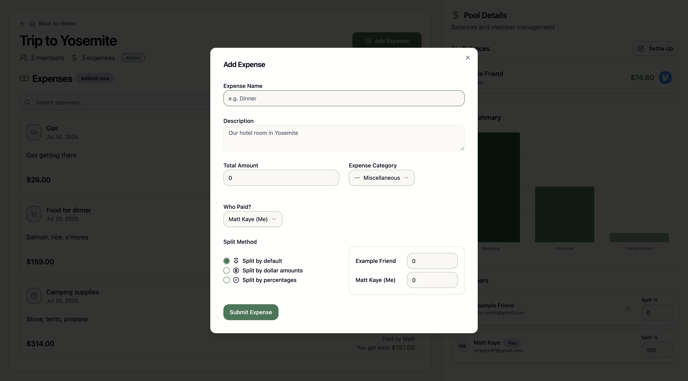

# Medici

Medici is a minimalistic Splitwise-like app for managing group expenses. It's namesake is the Florentine [House of Medici](https://en.wikipedia.org/wiki/House_of_Medici). It only has the most important features:

1. You can make groups ("pools")
2. You can add friends and add them to pools
3. You can add expenses to pools.
   - Expenses can be categorized
   - Expenses can be split evenly or unevenly, or by a default split percentage

Similarly to Splitwise, Medici will automatically simplify the debts between friends in the pool, so that you can pay each other back in the least number of transactions possible.

## Screenshots

### View Pools

|             Friends View              |                   Profile View                    |
| :-----------------------------------: | :-----------------------------------------------: |
|  |  |

### Pool Details

|            Roommates             |            Yosemite Trip             |
| :------------------------------: | :----------------------------------: |
|  |  |

### Add Expenses

## Self-Hosting

Medici has three components (a server, a frontend, and a Postgres database), and is trivial to self-host. You can run it with Docker Compose using the `compose.example.yaml` file, or you can run it locally with the `just` tool.

## Tools

Medici is a Rust (Axum) + React app, with a Postgres database. You can run it locally in a few steps:

1. `just setup`
2. In one terminal: `cd frontend && pnpm dev`
3. In another terminal: `cd backend && cargo watch -x run`
