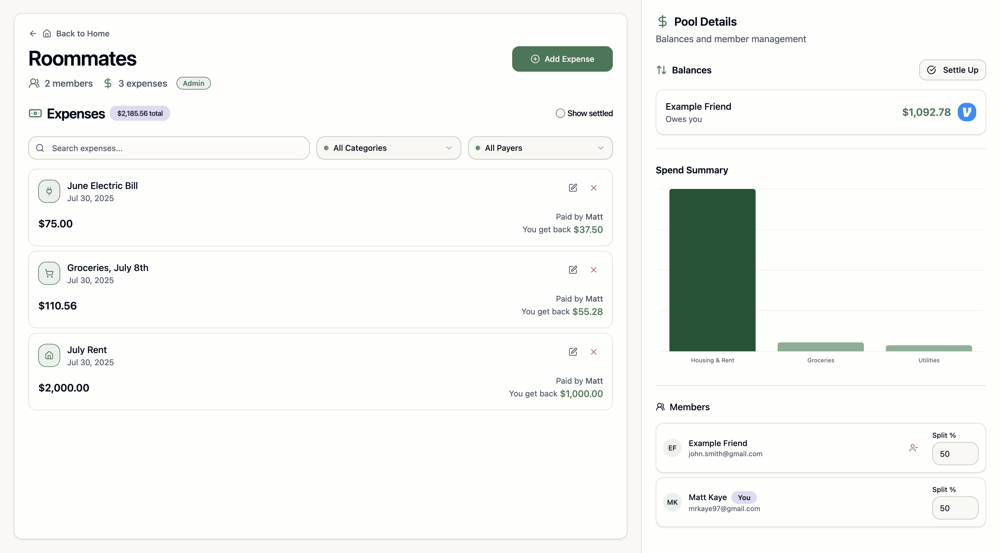

# Medici

Medici is a minimalistic, self-hostable alternative to Splitwise for managing group expenses. Named after the Florentine [House of Medici](https://en.wikipedia.org/wiki/House_of_Medici), it focuses on simplicity and privacy while providing all the essential features you need.

## Why Medici?

- **Privacy-first**: Self-host your financial data instead of trusting third parties
- **Minimalistic**: Clean, distraction-free interface with only essential features
- **Fast & Modern**: Built with Rust + React for performance and reliability
- **Easy deployment**: Single Docker Compose command to get started
- **No subscriptions**: Own your data, no recurring fees
- **Open Source**: Fully transparent codebase, no hidden agendas
- **No tracking**: No ads, analytics, or data collection
- **No limits**: Unlimited pools, friends, and expenses without hidden fees

## Features

### Core Functionality

1. **Expense Pools**: Create groups ("pools") to organize expenses by context (roommates, trips, etc.)
2. **Friend Management**: Add friends and organize them into relevant pools
3. **Smart Splitting**:
   - Set default split percentages per pool for quick expense entry
   - Split expenses evenly or with custom percentages
   - Automatic debt simplification to minimize transactions
4. **Expense Tracking**:
   - Categorize expenses for better organization
   - Add detailed descriptions and notes
   - Track who paid and who owes what

### Analytics & Insights

5. **Spending Analytics**: View spending patterns, top categories, and expense trends
6. **Debt Overview**: See who owes you money and how much you owe others at a glance
7. **Payment Integration**: Add Venmo handles for easy payment requests and settlements

### Privacy & Control

8. **Self-hosted**: Keep your financial data on your own infrastructure
9. **Open Source**: Full transparency and customizability
10. **No tracking**: No analytics, ads, or data collection

## Screenshots

### View Pools

|             Friends View              |                   Profile View                    |
| :-----------------------------------: | :-----------------------------------------------: |
|  |  |

### Pool Details

|            Roommates             |            Yosemite Trip             |
| :------------------------------: | :----------------------------------: |
|  |  |

### Add Expenses

## Self-Hosting

Medici has three components (a server, a frontend, and a Postgres database), and is trivial to self-host. You can run it with Docker Compose using the `compose.example.yaml` file, or you can run it locally with the `just` tool.

## Local Development

Medici is a Rust (Axum) + React app, with a Postgres database. You can run it locally in a few steps:

1. `just setup`
2. In one terminal: `cd frontend && pnpm dev`
3. In another terminal: `cd backend && cargo watch -x run`
